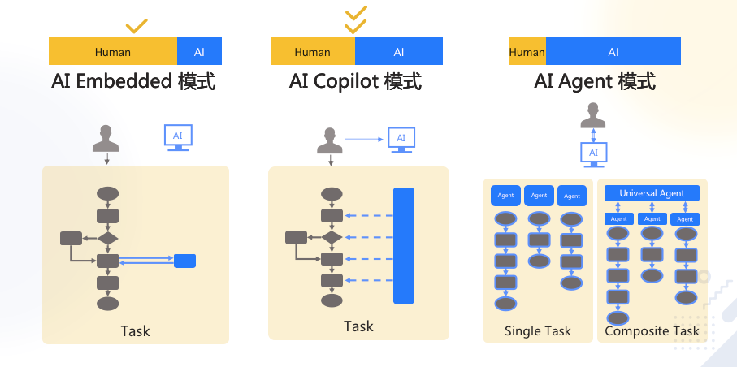
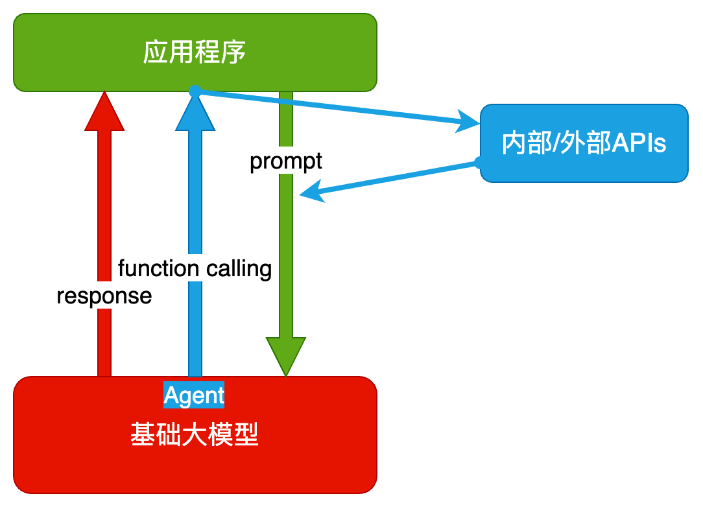
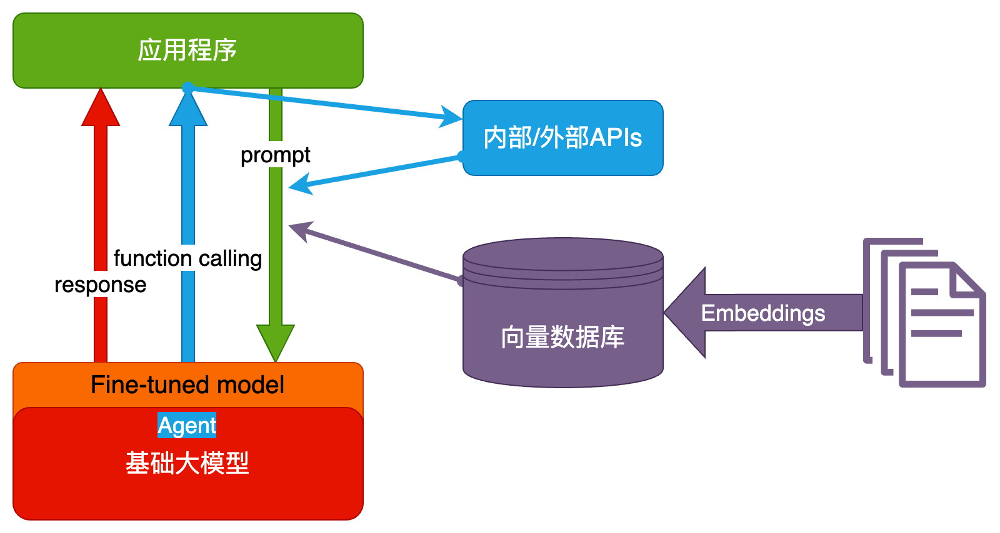
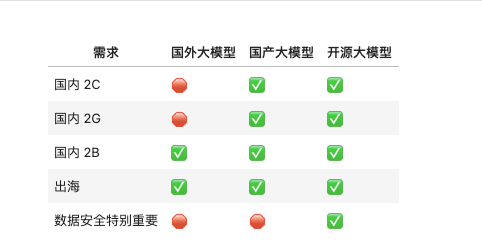

# AI 相关学习笔记

也许可能成为AI全栈工程师

## 知识体系

##  一些可能性
- 智能客服
- 智能知识库
- 智能数据分析
- 智能情报分析
- 智能助手

## 关于大模型LLM能干什么的一些实际运用案例
- 舆情分析：从公司产品的评论中，分析哪些功能/元素是用户讨论最多的，评价是正向还是负向
- 坐席质检：检查客服/销售人员与用户的对话记录，判断是否有争吵、辱骂、不当言论，话术是否符合标准
- 知识库：让大模型基于私有知识回答问题
- 零代码开发/运维：自动规划任务，生成指令，自动执行
- AI 编程：用 AI 编写代码，提升开发效率

## 大模型是啥？
大模型好比是一个函数， 给定一个输入， 得到一个输出， 但它不纯，每次的语意推理都导向不同的世界。

## 利用AIGC在工作链路中提升效能是最可观和真实的应用。

## 大模型是怎么生成结果的？
用不严密但通俗的语言描述大模型的工作原理：

- 大模型阅读了人类曾说过的所有的话。这就是「机器学习」，这个过程叫「训练」
- 把一串 token 后面跟着的不同 token 的概率存入「神经网络」。保存的数据就是「参数」，也叫「权重」
- 当我们给它若干 token，大模型就能算出概率最高的下一个 token 是什么。这就是「生成」，也叫「推理」
- 用生成的 token，再加上上文，就能继续生成下一个 token。以此类推，生成更多文字

## 对待 AI 的核心思路就是： **把 AI 当人看**

## 经典业务构架

- AI Embedded
- AI Copilot
- AI Agent

## 技术构架
- 纯Prompt

- Agent + Function Calling

- RAG

- Fine-tuning

## 技术路线选择

## 技术选型的额外因素
