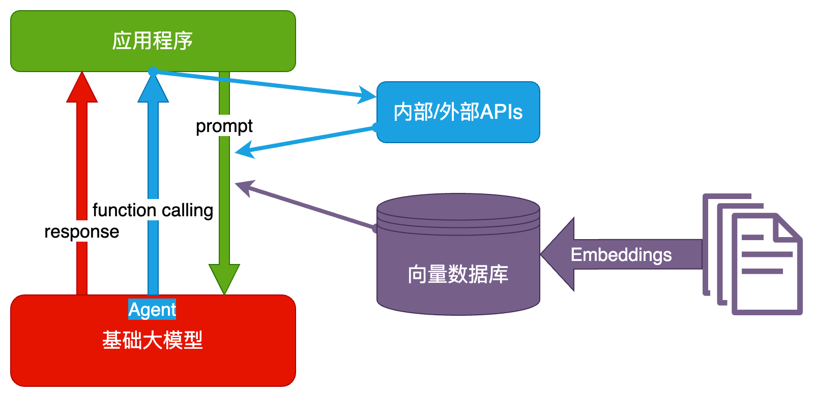

# AI 相关学习笔记

也许可能成为AI全栈工程师

## 知识体系

##  一些可能性
- 智能客服
- 智能知识库
- 智能数据分析
- 智能情报分析
- 智能助手

## 关于大模型LLM能干什么的一些实际运用案例
- 舆情分析：从公司产品的评论中，分析哪些功能/元素是用户讨论最多的，评价是正向还是负向
- 坐席质检：检查客服/销售人员与用户的对话记录，判断是否有争吵、辱骂、不当言论，话术是否符合标准
- 知识库：让大模型基于私有知识回答问题
- 零代码开发/运维：自动规划任务，生成指令，自动执行
- AI 编程：用 AI 编写代码，提升开发效率

## 大模型是啥？
大模型好比是一个函数， 给定一个输入， 得到一个输出， 但它不纯，每次的语意推理都导向不同的世界。

## 利用AIGC在工作链路中提升效能是最可观和真实的应用。

## 大模型是怎么生成结果的？
用不严密但通俗的语言描述大模型的工作原理：

- 大模型阅读了人类曾说过的所有的话。这就是「机器学习」，这个过程叫「训练」
- 把一串 token 后面跟着的不同 token 的概率存入「神经网络」。保存的数据就是「参数」，也叫「权重」
- 当我们给它若干 token，大模型就能算出概率最高的下一个 token 是什么。这就是「生成」，也叫「推理」
- 用生成的 token，再加上上文，就能继续生成下一个 token。以此类推，生成更多文字

## 对待 AI 的核心思路就是： **把 AI 当人看**

## 经典业务构架

- AI Embedded
- AI Copilot
- AI Agent

## 技术构架
- 纯Prompt

- Agent + Function Calling

- RAG

- Fine-tuning

## 技术路线选择

## 技术选型的额外因素

# Prompt

简单理解可以是 搜索时代的 关键词， 会是每个要跟上时代融入 AI 交互的必备技能。

Prompt门槛低，但上线非常高。

## Prompt调优

### 高质量的 prompt： **具体，丰富，少歧义**

调优训练在日常中就是**完整说明事情的能力**的训练。

## Prompt 的典型构成
**角色**：给 AI 定义一个最匹配任务的角色，比如：「你是一位软件工程师」「你是一位小学老师」

**指示**：对任务进行描述

**上下文**：给出与任务相关的其它背景信息（尤其在多轮交互中）

**例子**：必要时给出举例，学术中称为 one-shot learning, few-shot learning 或 in-context learning；实践证明其对输出正确性有很大帮助

**输入**：任务的输入信息；在提示词中明确的标识出输入

**输出**：输出的格式描述，以便后继模块自动解析模型的输出结果，比如（JSON、XML）

### 大模型对 prompt 开头和结尾的内容更敏感

### 「给例子」很常用，效果特别好

### 一切问题先尝试用 prompt 解决，往往有四两拨千斤的效果

向大模型发送的内容，只在推导， 无关训练。

## 思维链

有人在提问时以 "Let's think step by step 开头, 发现 AI 把问题拆分为多步骤推导会让结果更多精准。

这个过程相当于让 AI 年成了丰富的“上文”， 从而提升了“下文”的质量。
针对计算和逻辑推理比较有效。 

## 自洽性

一种对抗“幻觉”的手段： 多次演算，得到最多次出现的值。

## 思维树

在思维链的每一步采样多个分支

## 防止Prompt攻击

- 奶奶漏洞： 套路 AI
- Prompt 注入攻击： 改变既定设定

### 防范： 
-Prompt 注入分类器：做输入内容识别安检拦截层。
- 输入防御： 在输入中锁死回答范围。
- Moderation API 违规过滤。

## 关于 Prompt 的总结
  1. 别急着上代码，先尝试用 prompt 解决，往往有四两拨千斤的效果
  2. 但别迷信 prompt，合理组合传统方法提升确定性，减少幻觉
  3. 定义角色、给例子是最常用的技巧
  4. 用好思维链，让复杂逻辑/计算问题结果更准确
  5. 防御 prompt 攻击非常重要

## prompt 调优
  - GPTs (https://chat.openai.com/gpts/discovery)
  - Coze (https://www.coze.com/)
  - Prompt tune (https://gitee.com/taliux/prompt-tune)

### 额外共享
- https://github.com/linexjlin/GPTs - 泄露出来的高级 GPTs 的 prompt
- https://promptbase.com/
- https://github.com/f/awesome-chatgpt-prompts
- https://smith.langchain.com/hub