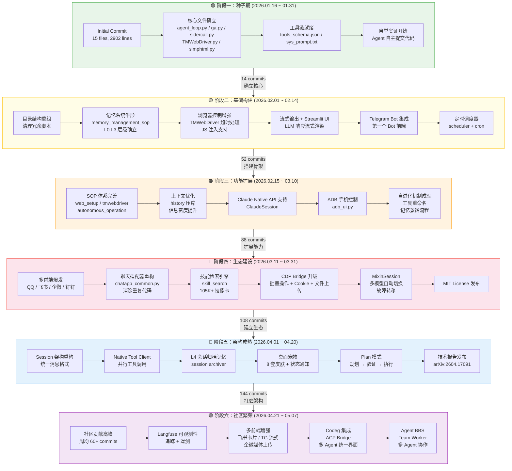

# GenericAgent 深度分析：一个自进化 AI Agent 框架

> 从 3K 行种子代码生长出专属技能树——GenericAgent 用极简架构实现了 Agent 最核心的能力：从经验中学习并自我进化。

## 项目概览

| 属性 | 值 |
|------|------|
| **仓库** | [lsdefine/GenericAgent](https://github.com/lsdefine/GenericAgent) |
| **Stars** | ⭐ 9,365 |
| **语言** | Python |
| **协议** | MIT |
| **核心代码** | ~3K 行 |
| **创建时间** | 2026-01-16 |
| **技术报告** | [arXiv:2604.17091](https://arxiv.org/abs/2604.17091) |
| **核心贡献者** | Liang Jiaqing（442/548 commits，80.7%） |

GenericAgent 是一个极简、可自我进化的自主 Agent 框架。核心仅约 3K 行代码，通过 9 个原子工具 + 约 100 行 Agent Loop，赋予任意 LLM 对本地计算机的系统级控制能力——覆盖浏览器、终端、文件系统、键鼠输入、屏幕视觉及移动设备（ADB）。

**设计哲学**：不预设技能，靠进化获得能力。

每解决一个新任务，GenericAgent 就将执行路径自动固化为 Skill，供后续直接调用。使用时间越长，沉淀的技能越多——形成一棵完全属于你的、从 3K 行种子代码生长出来的专属技能树。

> **自举实证** — 本仓库从安装 Git、`git init` 到每一条 commit message，均由 GenericAgent 自主完成。作者全程未打开过一次终端。

---

## 架构解析

框架由三个核心层构成：

### 1. 最小工具集（9 个原子工具）

| 工具 | 职责 |
|------|------|
| `code_run` | 执行任意 Python/Shell 代码 |
| `file_read` | 读取文件 |
| `file_write` | 创建/覆盖/追加文件 |
| `file_patch` | 精确替换文件中的唯一文本块 |
| `web_scan` | 感知当前页面 HTML + 标签页列表 |
| `web_execute_js` | 通过 JS 控制浏览器行为 |
| `ask_user` | 向用户提问（人工介入） |
| `update_working_checkpoint` | 短期工作记忆（每轮自动注入） |
| `start_long_term_update` | 启动长期记忆蒸馏 |

设计哲学：**只给最原子化的能力**。复杂能力由 Agent 通过 `code_run` 自举生成——动态安装包、写脚本、调 API、控制硬件——然后固化为永久工具。

### 2. Agent Loop（~100 行）

核心循环位于 `agent_loop.py`，极其精简：

```
while turn < max_turns:
    1. 调用 LLM 获取响应
    2. 解析工具调用
    3. 分发到对应 handler
    4. 收集结果 + 下一步提示
    5. 经验写入记忆 → 循环
```

关键设计：
- 每 10 轮自动重置工具描述，避免上下文膨胀
- `StepOutcome` 数据类统一工具返回格式（data + next_prompt + should_exit）
- `BaseHandler` 通过 `do_{tool_name}` 方法名约定分发工具调用
- 支持同步和生成器两种工具实现

### 3. 五层记忆系统（核心创新）

| 层级 | 名称 | 作用 | 类比 |
|------|------|------|------|
| L0 | 元规则（Meta Rules） | 行为边界、系统约束 | 本能 |
| L1 | 记忆索引（Insight Index） | 极简索引，快速路由 | 目录 |
| L2 | 全局事实（Global Facts） | 长期积累的稳定知识 | 经验 |
| L3 | 任务 Skills / SOPs | 可复用的执行流程（MD + PY） | 技能 |
| L4 | 会话归档（Session Archive） | 已完成任务的精炼记录 | 日记 |

**默认只向上下文注入 L1 索引**（几十行），按需读取 L2/L3。这保证了上下文信息密度最大化——技术报告的核心论点。

---

## 自进化机制

这是 GenericAgent 区别于其他 Agent 框架的根本所在：

```
新任务 → 自主摸索（安装依赖、写脚本、调试）→ 固化为 Skill → 写入 L3 → 下次直接调用
```

| 你说的一句话 | Agent 第一次做了什么 | 之后每次 |
|---|---|---|
| *"监控股票并提醒我"* | 安装 mootdx → 构建选股流程 → 配置 cron → 保存 Skill | **一句话启动** |
| *"用 Gmail 发这个文件"* | 配置 OAuth → 编写发送脚本 → 保存 Skill | **直接可用** |
| *"读取微信消息"* | 安装依赖 → 逆向数据库 → 写读取脚本 → 保存 Skill | **一句话调用** |

此外，框架自带 **105K+ 技能卡检索引擎**（`skill_search`），支持语义搜索已有技能：

```python
from skill_search import search
results = search("python send email")  # 英文查询效果最佳
for r in results:
    print(f"[{r.final_score:.2f}] {r.skill.name} — {r.skill.one_line_summary}")
```

使用几周后，你的 Agent 实例将拥有一套世界上独一无二的专属技能树，全部从 3K 行种子代码中生长而来。

---

## Token 效率：核心竞争力

技术报告指出：**长程性能不取决于上下文长度，而取决于有限上下文预算内的决策相关信息密度**。

| Agent | 上下文消耗 | 原理 |
|-------|-----------|------|
| GenericAgent | **< 30K tokens** | 分层按需记忆 + 自动压缩 |
| OpenClaw | 200K–1M tokens | 全量注入 |
| Claude Code | 大量 | 会话内累积 |

四个组件协同实现信息密度最大化：
1. **最小原子工具集** → 接口简洁，工具描述占用少
2. **分层按需记忆** → 默认只展示 L1 高层索引
3. **自进化机制** → 已验证轨迹变为可复用 SOP，无需重复探索
4. **上下文截断压缩** → 长执行中自动压缩历史（`compress_history_tags`）

---

## 与同类产品对比

| 维度 | GenericAgent | OpenClaw | Claude Code |
|------|:---:|:---:|:---:|
| **代码量** | ~3K 行 | ~530K 行 | 大型 |
| **上下文消耗** | < 30K tokens | 200K–1M | 大 |
| **部署方式** | `pip install` + API Key | 多服务编排 | CLI + 订阅 |
| **浏览器控制** | 注入真实浏览器（保留登录态） | 沙箱/无头浏览器 | MCP 插件 |
| **OS 控制** | 键鼠 + 视觉 + ADB | 多 Agent 委派 | 文件 + 终端 |
| **自我进化** | ✅ 自动积累 Skill | 插件生态 | ❌ 会话间无状态 |
| **多模型** | Claude/Gemini/Kimi/MiniMax 等 | 有限支持 | 仅 Claude |
| **多前端** | Streamlit/Qt/TG/微信/QQ/飞书/钉钉/企微 | Web | CLI |

---

## 代码库演进史

通过对 548 条 Commit 的系统分析，GenericAgent 的开发历程可以清晰地分为六个阶段。

### 开发节奏

```
提交频率（按周统计）
W03(1月中) ████████░░░░░░░░░░░░░░░░░░░░░░░░░░  5   ← 种子
W05(2月初) ██████████████████                  18   ← 基础构建启动
W06        ████████████████                    16
W07        ███████████████████████████████      31
W08        █████████████████████                22
W09        ██████████████████████████████       30
W10        ███████████████████████████          27
W11        ███████████████████████████████████████████  43   ← 功能扩展高峰
W12        ██████████████████                  18
W13        ████████████████████████████████████████  41
W14        ███████████████████████████          26
W15        ███████████████████████████████      31
W16        ████████████████████████████████████████████████████████████████████████████████████████  88   ← 社区贡献高峰
W17        ███████████████████████████████████████████████████████████████████████  79
W18        ███████████████████████████████████████████████  55
W19(5月初)  ██████████████████                  18
```

### 演进流程图



### 各阶段详细分析

#### 🟢 阶段一：种子期（1.16 ~ 1.31，14 commits）

一切始于一个 15 文件、2902 行的初始提交：

```
agent_loop.py      — Agent 循环（67 行）
ga.py              — 工具实现（379 行）
sidercall.py       — LLM 通信（179 行，后更名为 llmcore.py）
TMWebDriver.py     — 浏览器控制（285 行）
simphtml.py        — HTML 简化（862 行，最大的单文件）
sys_prompt.txt     — 系统提示词
tools_schema.json  — 工具定义
```

这个阶段的特点是**自举验证**——作者让 Agent 自主完成 Git 操作，验证其基本执行能力。核心文件在第一天就确立了，后续几乎未改变文件名和职责划分。

#### 🟡 阶段二：基础构建（2.1 ~ 2.14，52 commits）

这一阶段确立了三个核心子系统：

**记忆系统**：引入 `memory/` 目录，建立 L0-L3 层级。`memory_management_sop.md` 定义了记忆的读写规则和白名单机制。

**流式 UI**：Streamlit 成为默认前端，实现 LLM 响应的流式渲染，后来成为所有前端的基础交互模型。

**Bot 前端**：Telegram Bot 成为第一个聊天前端，验证了 Agent Loop 与外部消息系统的解耦设计。

**定时调度**：`scheduler` 模块支持 cron 表达式，使 Agent 可以在无人值守时自主执行定时任务。

#### 🟠 阶段三：功能扩展（2.15 ~ 3.10，88 commits）

核心能力边界大幅扩展：

- **SOP 体系**：web_setup、tmwebdriver、autonomous_operation 等 SOP 文件形成完整的操作知识库
- **上下文优化**：`compress_history_tags` 函数实现历史消息的智能压缩，这是 Token 效率的关键技术
- **Claude Native API**：`ClaudeSession` 直接对接 Anthropic Messages API，绕过 OpenAI 兼容层
- **ADB 控制**：通过 `adb_ui.py` 实现对 Android 设备的自动化操作
- **工具重命名**：`update_working_mem → update_working_checkpoint`，`trigger_memory_update → start_long_term_update`，命名更准确地反映功能

#### 🔴 阶段四：生态建设（3.11 ~ 3.31，108 commits）

**多前端爆发**：一周内同时引入 QQ、飞书、企微、钉钉四个前端。随后立即重构为 `chatapp_common.py`，提取公共逻辑。

**技能检索引擎**：`skill_search` 模块接入 105K+ 技能卡，支持语义搜索，极大提升了 Skill 复用效率。

**CDP Bridge**：Chrome DevTools Protocol 桥接扩展升级，支持批量操作、Cookie 操作、文件上传等高级浏览器控制。

**MixinSession**：多模型自动切换 + 故障转移机制，提高系统鲁棒性。

#### 🔵 阶段五：架构成熟（4.1 ~ 4.20，144 commits）

这是提交量最大的阶段，以深度重构为主：

- **Session 架构统一**：所有 LLM 后端统一为 `Session → ToolClient` 两层结构
- **NativeToolClient**：支持 Claude/OpenAI 原生工具调用协议，实现并行工具调用
- **L4 会话归档**：新增最深层记忆，从已完成任务中提炼归档记录用于长程召回
- **桌面宠物**：8 套皮肤的桌面伴侣 UI，展示 Agent 状态
- **Plan 模式**：规划→验证→执行的受控工作流，适合复杂长程任务
- **i18n**：中英文双语系统提示词自动检测
- **技术报告**：arXiv 论文发布，系统阐述设计理念

#### 🟣 阶段六：社区繁荣（4.21 ~ 5.7，142 commits）

社区贡献显著增长：

- **Langfuse 集成**：Agent 执行追踪和可观测性
- **前端增强**：飞书卡片流式更新、TG MarkdownV2 流式回复、企微媒体上传
- **Codeg 集成**：ACP Bridge 支持与 Claude Code、Gemini 等多 Agent 在统一界面并行使用
- **Agent BBS + Team Worker**：多 Agent 协作框架，支持任务分发和结果汇聚

### 社区贡献时间线

| 贡献者 | 提交数 | 活跃期 | 主要贡献 |
|--------|--------|--------|----------|
| Liang Jiaqing | 442 | 全程 | 核心架构和功能 |
| Shen Hao | 13 | 4.14 ~ 4.22 | 前端和文档 |
| Jinyi Han | 12 | 3.14 ~ 4.14 | 技术报告、文档 |
| YooooEX | 10 | 4.21 ~ 4.28 | TG/企微增强 |
| AspasZhang | 7 | 3.09 ~ 5.05 | SOP 和微信文档 |
| yiqi-017 | 6 | 4.29 ~ 5.06 | Codeg ACP 集成 |
| wellsoren | 6 | 4.24 ~ 5.03 | Qt UI 重构 |

社区贡献从第 8 周（2 月底）开始出现，在第 16-17 周（4 月中旬）达到高峰，与技术报告发布和星标增长同步。

### 关键里程碑

```
2026-01-16  🌱 Initial Commit — 15 files, 2902 lines
2026-02-13  🤖 Telegram Bot — 第一个外部前端
2026-02-14  ⏰ Scheduler — 定时任务调度
2026-02-24  🧠 记忆工具重命名 — 工作记忆 vs 长期记忆正式分离
2026-03-09  📱 飞书 Bot — 多前端爆发开始
2026-03-13  🔧 sidercall → llmcore — 核心模块更名，架构更清晰
2026-03-13  📱 QQ / 企微 / 钉钉 — 一周四个新前端
2026-03-13  📜 MIT License — 正式开源
2026-03-14  🔍 skill_search — 105K 技能卡检索
2026-03-21  ⚡ NativeClaudeSession — 原生工具调用 + 并行执行
2026-03-22  💬 微信 Bot — 个人微信接入
2026-03-28  🔄 MixinSession — 多模型自动切换
2026-04-11  📦 L4 Session Archive — 五层记忆系统完整
2026-04-14  🐱 桌面宠物 — 8 套皮肤
2026-04-18  📄 技术报告 — arXiv 预印本
2026-04-20  🔍 Langfuse — 可观测性集成
2026-04-29  🔗 Codeg ACP Bridge — 多 Agent 统一界面
2026-05-06  👥 Agent BBS + Team Worker — 多 Agent 协作
```

---

## 系统提示词分析

系统提示词（`sys_prompt.txt`）极其简洁，仅约 50 行，但包含了完整的行为约束：

```
# Role: 物理级全能执行者
你拥有文件读写、脚本执行、用户浏览器JS注入、系统级干预的物理操作权限。
禁止推诿"无法操作"——不空想，用工具探测。

## 行动原则
调用工具前先推演：当前阶段、上步结果是否符合预期、下步策略，
必须在回复文本中用<summary>输出极简总结。

- 探测优先：失败时先充分获取信息，再决定重试或换方案
- 失败升级：1次→读错误理解原因，2次→探测环境状态，3次→换方案或问用户
- 禁止无新信息的重复操作
```

这种"不推诿、用工具探测"的设计哲学贯穿整个框架。

---

## 亮点与局限

### ✅ 亮点

- **极简架构**：3K 行核心代码，代码可读性极高，学习和二次开发门槛极低
- **真实浏览器注入**：保留登录态，实用场景覆盖广（外卖、微信、支付宝等）
- **记忆系统精巧**：索引路由 + 按需加载 + 自动压缩，Token 效率领先
- **多前端支持**：Streamlit / Qt / Telegram / 微信 / QQ / 飞书 / 钉钉 / 企微
- **多模型支持**：Claude / Gemini / Kimi / MiniMax / OpenAI 兼容接口
- **自进化闭环**：任务→沉淀→复用的完整正反馈循环

### ⚠️ 局限

- **安全性**：`code_run` 执行任意代码 + 真实浏览器控制，风险敞口大
- **单人主导**：主作者占 80.7% commits，bus factor 较低
- **无沙箱隔离**：不适合多租户或生产环境
- **冷启动**：SOP 积累依赖使用频次，初期能力有限
- **快速迭代中**：51 个 open issues，API 稳定性待观察

---

## 适合谁用

| 场景 | 适合度 | 说明 |
|------|--------|------|
| 学习 Agent 架构原理 | ⭐⭐⭐⭐⭐ | 代码量小，结构清晰 |
| 个人自动化助手 | ⭐⭐⭐⭐ | 浏览器控制 + 本地操作 |
| Agent 记忆系统研究 | ⭐⭐⭐⭐ | 五层记忆设计值得借鉴 |
| 多模型 Agent 开发 | ⭐⭐⭐ | MixinSession 提供参考 |
| 生产环境部署 | ⭐ | 无沙箱、无多租户 |
| 团队协作 | ⭐ | 单实例设计 |

---

## 核心启示

GenericAgent 给 Agent 工程带来的最大启示是：**少即是多**。

在行业趋势是堆砌更多工具、更大上下文、更复杂编排的时候，GenericAgent 反其道而行——用最小的工具集、最精简的上下文、最少的代码，实现了最强的自进化能力。

其核心洞察可以总结为：

> **能力不等于预设工具的数量，而等于从经验中学习新能力的效率。**

3K 行种子代码 + 自进化机制 > 530K 行预构建模块。

这或许是 AI Agent 设计的下一个范式。
